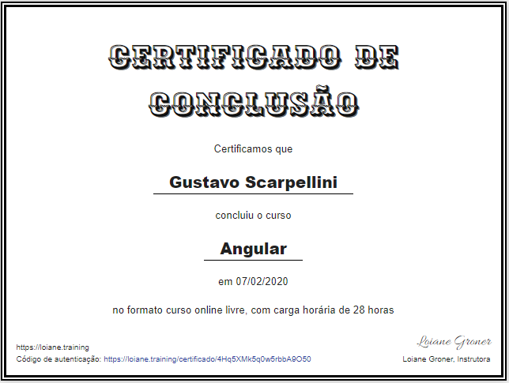

<h1 align="center">
    
</h1>

<h4 align="center">
  🚀 Angular Full Course - Loiane Grooner
</h4>

  <a href="#-course">Course</a>&nbsp;&nbsp;&nbsp;|&nbsp;&nbsp;&nbsp;
  <a href="#rocket-learned">What i've learned</a>&nbsp;&nbsp;&nbsp;|&nbsp;&nbsp;&nbsp;
  <a href="#-screenshots">Screenshots</a>&nbsp;&nbsp;&nbsp;|&nbsp;&nbsp;&nbsp;

 

## 💻 Course

Loiane must be the best teacher of all times when it comes to patiently explaining how Angular works. This was by far the best free course i did and made me in love with Angular. During the course we developed a lot of small projects while talking about each Angular component separetly. By far the most challenging ones were the Forms projects, but the magic of video-classes is that you can go back and foward how many times you want. I highly recommend this course for any portuguese speaking person that wants to learn all the main funtionalities of Angular.

## 🔖 Cerificate

<h1 align="center">
    
</h1>
## :rocket: What i've learned

All of the bellow were taught in the course curriculum:

1. Data Binding
    * Property binding and interpolation
    * Class and Style binding
    * Event binding
    * To way data binding
    * Input properties
    * Output properties
    * Component lifecycle
    * DOM and Template access with ViewChild 

2. Angular CLI
    * Install CLI and create projects
    * Create components and services with ng generate
    * Using pre-processor (SASS, LESS, Stylus)
    * ng lint, ng test, ng e2e
    * Project structure
    * Generating production build
    * Installing libs (bootstrap, jquery, lodash)

3. Directives
    * Types of directives in Angular
    * ngIf, ngSwitch, ngSwitchCase, ngSwitchCaseDefault, ngFor, ngElse
    * ngClass, ngStyle, Elvis operator, ng-content
    * ElementRef and Renderer
    * HostListener and Hostbinding

4. Services
    * Creating a service
    * Dependecy injection and using in a component
    * Service instance scopes and modules (singleton, etc)
    * Comunication between components using services (event broadcast)
    * Injecting a service in another service

5. Pipes
    * Creating pipes, params and nested pipes
    * Applying Locale
    * Async pipe

6. Routes
    * RouterLink

7. Forms
    * Template driven form
    * Data driven form
---

Feito com ♥ by Scarpellini :shipit: 